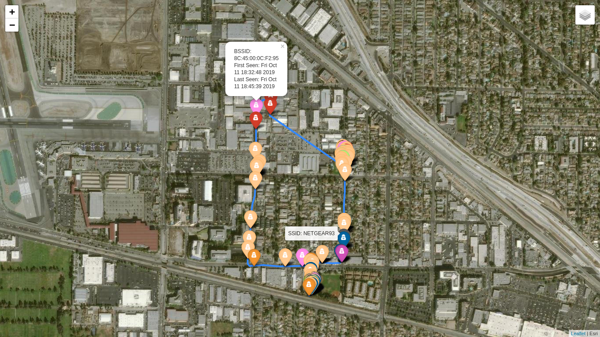

<h1 align="center">Creep Detector Using Kismet And Google Colab</h1>

<h2>Description</h2>
This project has been directly inspired from <a href="https://github.com/skickar/CreepDetector/">Skicar's Creep Detector</a> but provides some extra features like better tiling, better visual cues in the form of tooltips and popups, etc. The notebook analyzes <i>Kismet</i> output files to map out the potentiaal suspicious targets and maps  them onto a html file which is then served over a webserver.

<h2>Usage <a align="left" href="https://colab.research.google.com/github/whokilleddb/Creep-Detector/blob/main/CreepDetector.ipynb" target="_blank"></a> </h2>

Open this notebook in Google Colab followed by creating a folder in your Google Drive account by the name of <code>Creep-Detector</code>. There you can create a folder inside it to store your Kismet output files. However, remember to change the file locations in the notebook accordingly:

```ipython
# Read files
tree = ET.parse('./gdrive/MyDrive/Creep-Detector/session_data/Kismet-20191011-18-31-55-1.netxml') 
gps_tree = ET.parse('./gdrive/MyDrive/Creep-Detector/session_data/Kismet-20191011-18-31-55-1.gpsxml')
```

On successfully running the notebook, you should have a map containing markers pointing to the spots where suspicious entitities were detected. It can also be accessed via a public link as given by colab.

<h2>Preview</h2>


<h2>Disclaimer</h2>
The inspiration for this project and the sample data has been derived from <a href="https://github.com/skickar/CreepDetector">Skicar's Creep Detector</a>
